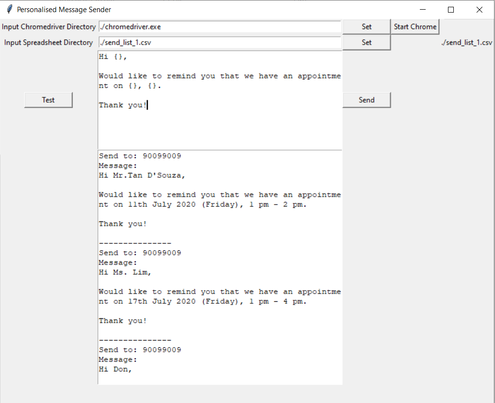

# Send Multiple Personalised Messages to WhatsApp
Send multiple messages to WhatsApp using Python and Selenium.

# Installation
Clone the repository `git clone <https/ssh link>`

Install required library using `pip install -r requirements.txt`

Download [chromedriver](https://chromedriver.storage.googleapis.com/index.html). Find out your Chrome [version](https://www.howtogeek.com/299243/which-version-of-chrome-do-i-have/) first. 

Then, extract chromedriver and place it at the main directory (where wa_send.py is located).

# Usage
### Prepare your contact list
- Make sure that you save the contacts you want to save to in your phone (and that it came up at the top when you search for it - beware of duplicate/ similar names).

### Prepare your csv
- Open send_list.csv and modify the column values.
- You can choose to have any number of columns (variable message). 
- Save the changes in your csv file. 

### Run the code
`python sender_gui.py`
- Input your template message, for example `Dear {}, please be reminded that you have an appointment on {}. Thank you.`
- Select chromedriver and data spreadsheet. Start Chrome. 
- Check your messages by clicking `Test`.
- Send your messages by clicking `Send`.

### Use pyinstaller to create an executable 
- Install pyinstaller `pip install https://github.com/pyinstaller/pyinstaller/archive/develop.zip`
- Run this command `pyinstaller --onefile -w sender_gui.py`
- Move the chromedriver.exe and spreadsheet.csv to the dist folder.
- You can now send the dist folder with everything inside it to someone else who might need it.

### Sending using number
- Note that currently, the code is set up to send to Singapore number. 
- If you want to change that, modify the following line: `driver.get("https://web.whatsapp.com/send?phone=65{}&source=&data=#".format(phone_no))`
    - change the number 65 to your country's code or remove the number completely. 

### References
- https://lesmartomation.com/send-whatsapp-messages-with-automated-script-using-selenium/
- https://pyinstaller.readthedocs.io/en/stable/operating-mode.html
- https://www.youtube.com/watch?v=YXPyB4XeYLA